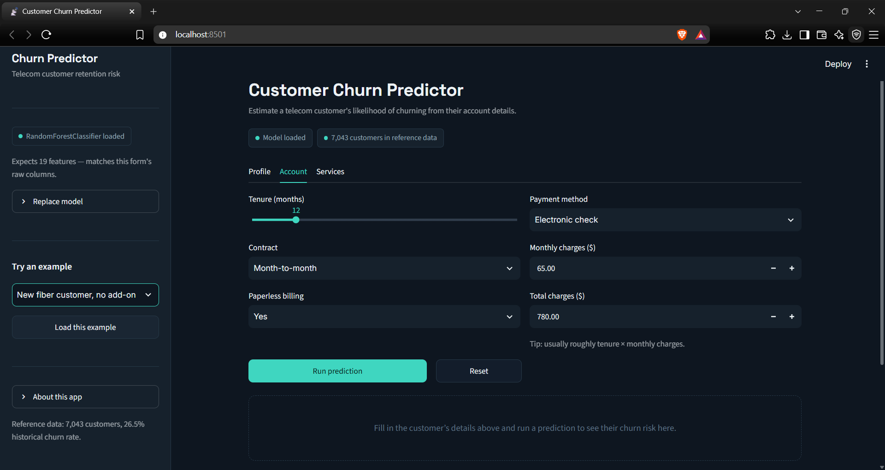
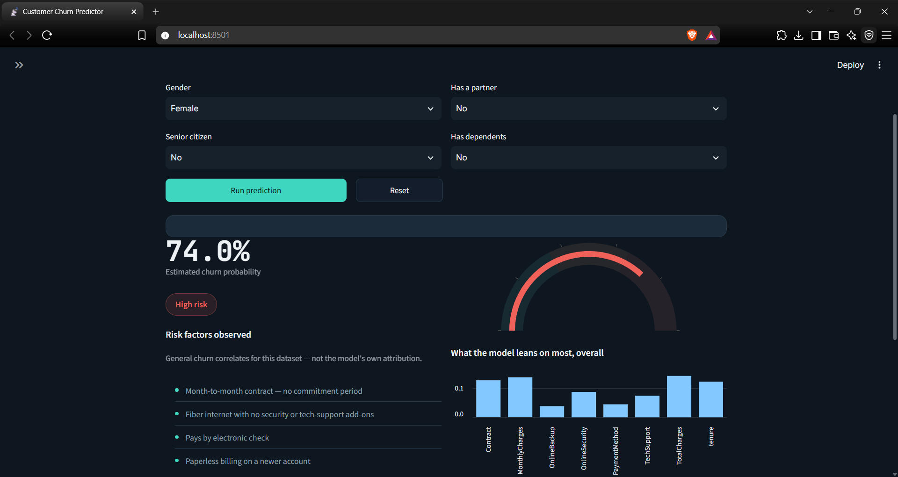
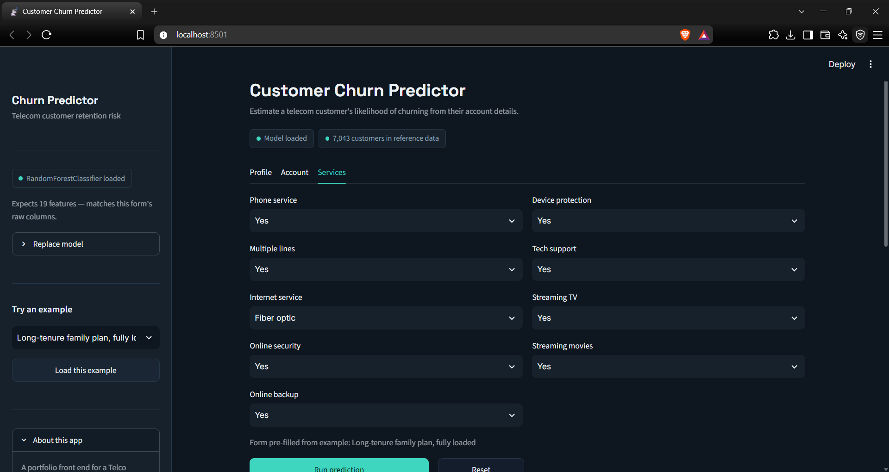
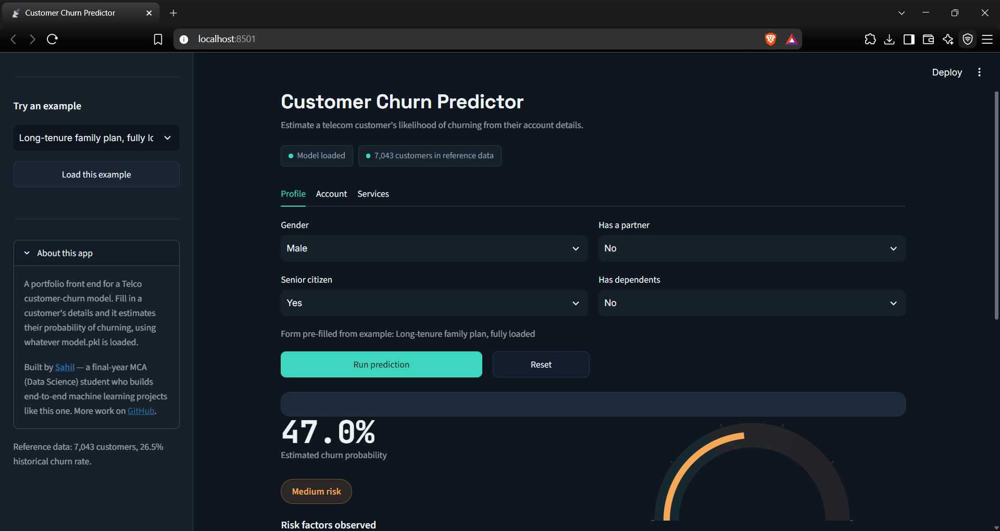

# 📊 Customer Churn Prediction App

A Streamlit web app that predicts whether a telecom customer is likely to churn, powered by a trained machine learning model.


---

## 🔗 Live Demo

<!-- Add your deployed Streamlit app link below -->
**[▶️ Try the app here](your-live-link-here)**

---

## 🖼️ Screenshots

<!-- Drop your screenshots below. Example markdown for an image: -->
<!--  -->

| Home Page | Prediction Result |
|:---:|:---:|
| |  |

| Model Details Section | About Section |
|:---:|:---:|
|  |  |

---

## ✨ Features

- Interactive UI to input customer details (tenure, contract type, charges, services, etc.)
- Real-time churn prediction using a pre-trained ML model
- Clean, modern, animated interface with smooth transitions
- **Model Details** section showing model info and performance
- **About this App** section with project background and author links

---

## 🛠️ Tech Stack

- **Frontend:** Streamlit
- **Model:** scikit-learn (trained and serialized as `.pkl`)
- **Data:** Pandas, NumPy
- **Language:** Python 3.10+

---

## 📁 Dataset

Trained on the [Telco Customer Churn dataset](https://www.kaggle.com/datasets/blastchar/telco-customer-churn) (`WA_Fn-UseC_-Telco-Customer-Churn.csv`), containing customer demographics, account information, and service usage details.

---

## 🚀 Getting Started

### Prerequisites

- Python 3.10 or higher
- pip

### Installation

```bash
# Clone the repository
git clone https://github.com/Sahil2171/your-repo-name.git
cd your-repo-name

# Create a virtual environment (optional but recommended)
python -m venv venv
source venv/bin/activate   # On Windows: venv\Scripts\activate

# Install dependencies
pip install -r requirements.txt
```

### Run the app

```bash
streamlit run app.py
```

The app will open in your browser at `http://localhost:8501`.

---

## 📂 Project Structure

```
├── app.py                          # Main Streamlit application
├── styles.py                       # Main Styling sheet
├── customer_churn_model.pkl        # Trained churn prediction model
├── encoders.pkl
├── requirements.txt                # Python dependencies
├── assets/                         # Screenshots and static assets
└── README.md
```

---

## 🧠 Model Details

- **Type:** _Random Forest Classifier
- **Trained on:** Telco Customer Churn dataset
- **Accuracy:** 84%
- **Training notebook:** [Google Colab link](https://colab.research.google.com/drive/1QIn16itjYjR7OhZeDDWW5d3VjIwIckpF?usp=sharing)

---

## 👤 About

Built by **Sahil** — Final-year MCA (Data Science) student.

- GitHub: [@Sahil2171](https://github.com/Sahil2171)
- LinkedIn: [@Sahil2171](https://www.linkedin.com/in/sahilpatil2171)

---

## 📄 License

This project is licensed under the [MIT License](LICENSE).
